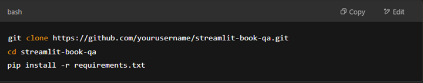
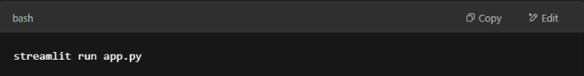
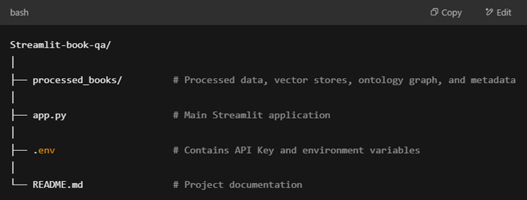
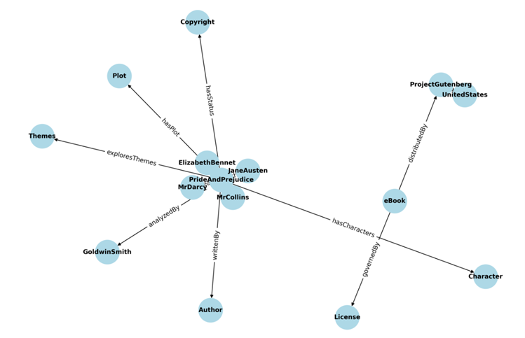
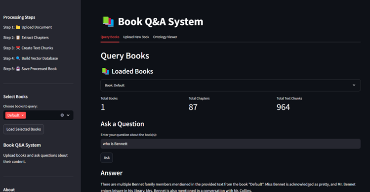

# 📚 Streamlit Book Q&A System
The Streamlit Book Q&A System is a powerful and user-friendly web application that transforms static book files (PDF or TXT) into interactive, searchable knowledge bases. Designed with simplicity and functionality in mind, this tool allows users to upload books, generate knowledge graphs, and ask natural language questions with contextual answers attributed to source material.
________________________________________
🚀 Features
•	📁 File Upload: Easily upload PDF or TXT files.
•	🧠 Content Processing: Automatically extracts and segments text, identifying chapters and sections.
•	📦 Vector Database: Uses Google's embedding model to embed text chunks and stores them in a FAISS vector store for fast similarity search.
•	🌐 Ontology Generation (Optional): Generates a basic knowledge graph using Google Generative AI (Gemini), extracting key concepts and relationships.
•	🕸 Knowledge Graph Viewer: Visualizes the ontology using NetworkX and Matplotlib.
•	📚 Multi-Book Querying: Query one or more books at once for comprehensive results.
•	🧠 RAG-Based Q&A: Utilizes a Retrieval-Augmented Generation (RAG) pipeline powered by LangChain and Google Generative AI for accurate, contextual answers.
•	📌 Source Attribution: Displays book title, chapter, and page for each answer’s context.
•	💬 Chat Interface: Includes a conversational interface to explore book contents interactively.
•	💾 Data Persistence: Saves processed data locally to avoid repeated processing.
•	🔐 Password Protection: Simple authentication mechanism to secure access.
•	🎛️ Streamlit Interface: Intuitive and interactive UI for seamless user experience.
________________________________________
🛠 Tech Stack
•	Frontend: Streamlit
•	NLP & RAG: LangChain, Google Generative AI (Gemini)
•	Embedding & Vector Store: Google Embeddings, FAISS
•	Knowledge Graph: NetworkX, Matplotlib
•	File Parsing: PyMuPDF, pdfminer, or pdfplumber for PDFs; standard I/O for TXT
•	Authentication: Simple password mechanism
________________________________________
🧰 Installation:
 
________________________________________
▶️ Usage
1.	Start the app:

2.	Login:
Enter the password to access the interface.
3.	Upload Books:
Upload one or more PDF/TXT files via the file uploader.
4.	Process & Analyze:
Books are split into sections, embedded, and indexed. Optionally generate a knowledge graph.
5.	Query Content:
Ask natural language questions about any processed book(s). The system returns accurate answers with source citations.
6.	Explore Knowledge Graph:
Visualize the ontology derived from the book using the Knowledge Graph viewer.
________________________________________
________________________________________
📂 Project Structure:

 ________________________________________
🛡️ Authentication
The app uses a basic password-based login system. Update the password in the config or environment variable for security.
### Password: AJAY@2025
________________________________________
📬 Contact
For questions, suggestions, or collaborations:
Ajay Bhatt
Email: ajayabhatt441aj@gmail.com 
________________________________________
🧬 Testing Link:
http://157.20.172.159:9015/

Knowledge Graph (Ontology)

Ontology Relationship Concepts

 
Streamlit Application UI

